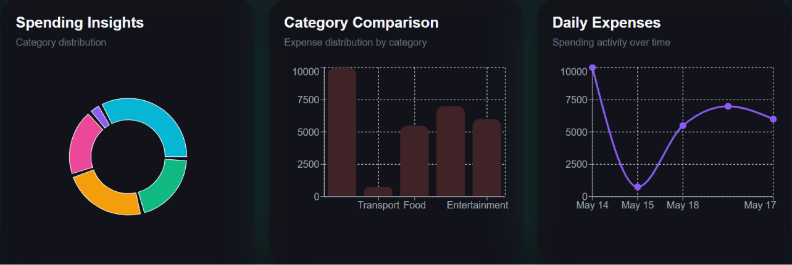

# ✨ Quartly

A sleek and minimalist expense tracking dashboard built with **React**, **TypeScript**, **Tailwind CSS**, and **Framer Motion**.

Quartly focuses on elegant design, smooth interactions, insightful analytics, and a luxury-inspired glassmorphism UI.

---

# 📁 Project Structure

```txt
src/
├── components/
├── charts/
├── transactions/
├── context/
├── pages/
├── styles/
└── types/
```

Quartly follows a modular component-based architecture focused on scalability and maintainability.

---

# 🌌 Features

- 💸 Expense tracking
- 📊 Interactive analytics
- 📈 Bar graphs & pie charts
- 🔍 Live search & filtering
- 🌙 Dark mode
- 📄 PDF expense export
- 🧊 Glassmorphism UI
- 📱 Responsive layout
- ⚡ Smooth animations
- 🗂️ Custom categories
- 🧾 Transaction history

---

# 🛠️ Tech Stack

- ⚛️ React
- 🟦 TypeScript
- 🎨 Tailwind CSS
- 🎞️ Framer Motion
- 📑 jsPDF
- ⚡ Vite

---

## 📸 Screenshots

## Light Version

#### Dashboard Overview


### Transaction List + Transaction Form


### Pie Chart + Bar Graph + Histogram


### Dark Version

### Dashboard Overview


### Transaction List + Transaction Form


### Pie Chart + Bar Graph + Histogram


---

# 🚀 Installation

Clone the repository:

```bash
git clone https://github.com/YOUR_USERNAME/quartly.git
```

Go into the project folder:

```bash
cd quartly
```

Install dependencies:

```bash
npm install
```

Start the development server:

```bash
npm run dev
```

---

# 🎯 Goals

Quartly was designed to explore:
- modern UI/UX principles
- frontend architecture
- analytics visualization
- polished interaction design
- minimalist product aesthetics

---

# 📜 License

MIT License © 2026 Kenny Richardson Kodipally