# ✨ Quartly

A modern cloud-synced personal finance platform built with React, TypeScript, Firebase, Tailwind CSS, and Framer Motion.

Quartly helps users track expenses, analyze spending patterns, visualize financial trends, and securely sync data across devices using Google Authentication and Firestore.

## 🌐 Live Demo

https://quartly.onrender.com

---

# 📁 Project Structure

```txt
src/
├── assets/
├── components/
│   ├── charts/
│   ├── insights/
│   ├── transactions/
│   └── ui/
├── context/
├── firebase/
├── pages/
├── types/
└── styles/
```

Quartly follows a scalable component-based architecture designed for maintainability, performance, and future feature expansion.

---

# 🚀 Features

## Authentication & Cloud Sync

* Google Authentication
* Firebase Authentication
* Firestore Cloud Database
* Persistent User Sessions
* Cross-Device Data Sync

## Expense Management

* Add Expenses
* Categorize Expenses
* Custom Categories
* Transaction History
* Search Transactions
* Transaction Filtering

## Analytics

* Monthly Spending Insights
* Expense Breakdown
* Spending Trends
* Largest Expense Analysis
* Interactive Charts

## User Experience

* Dark Mode
* Glassmorphism Design
* Responsive Layout
* Smooth Animations
* Profile Management
* Cloud Persistence

## Exporting

* PDF Expense Reports
* Downloadable Spending Records

---

# 🛠️ Tech Stack

### Frontend

* React
* TypeScript
* Vite
* Tailwind CSS
* Framer Motion

### Backend Services

* Firebase Authentication
* Firestore Database

### Libraries

* jsPDF
* Lucide React

---

# 📸 Screenshots

## Login Page

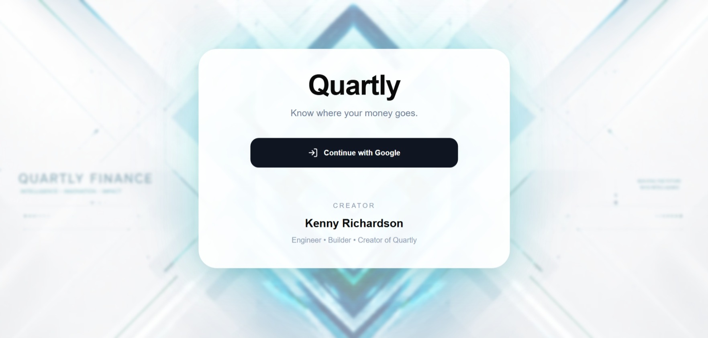

## Light Mode

### Dashboard

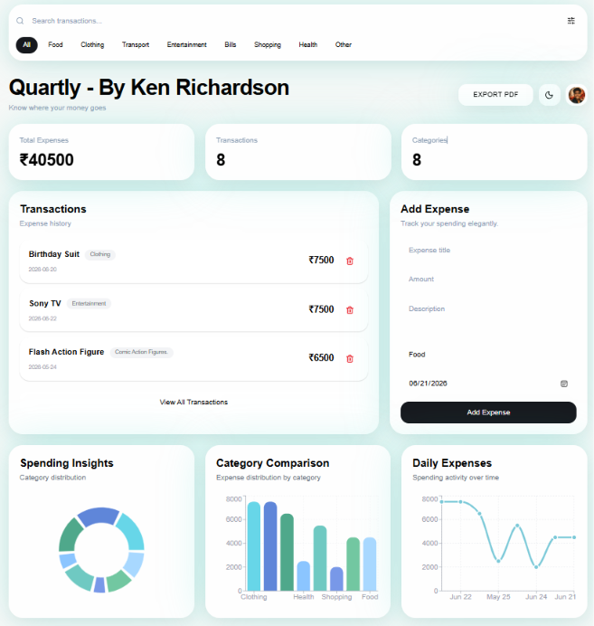

### Transactions

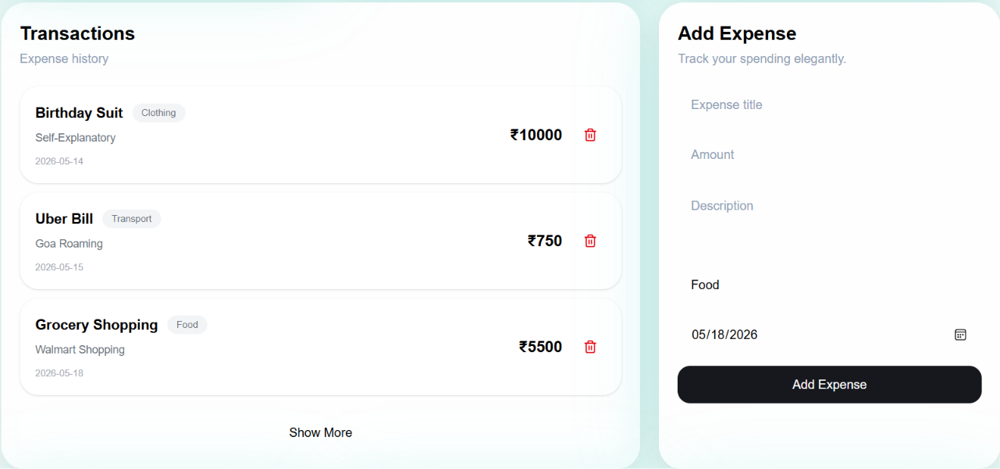

### Analytics

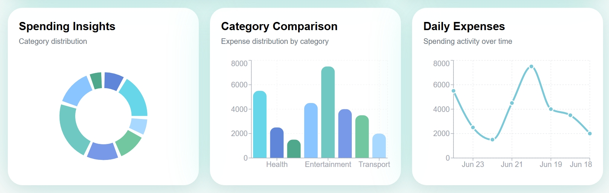

### Transaction Modal

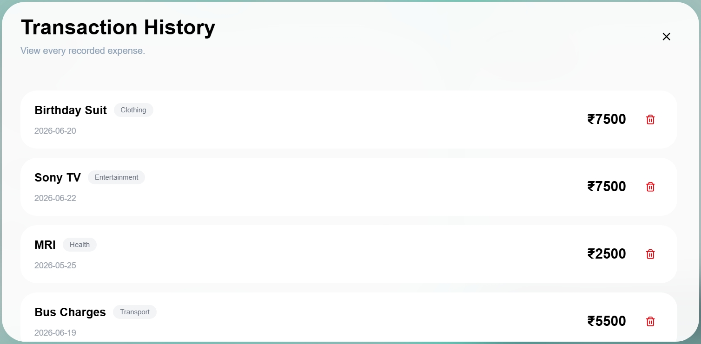

### Insights Page

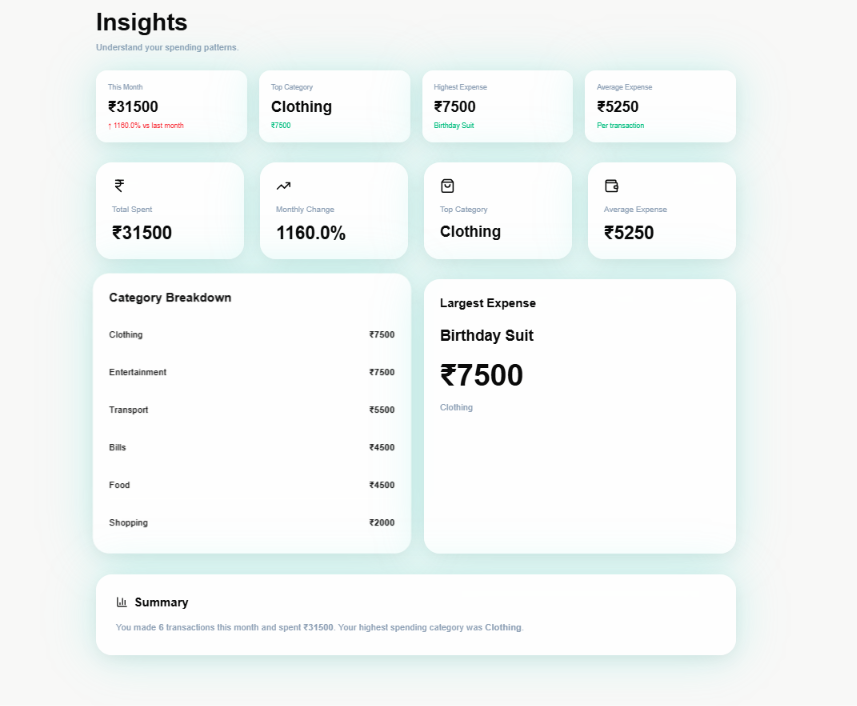

## Dark Mode

### Dashboard

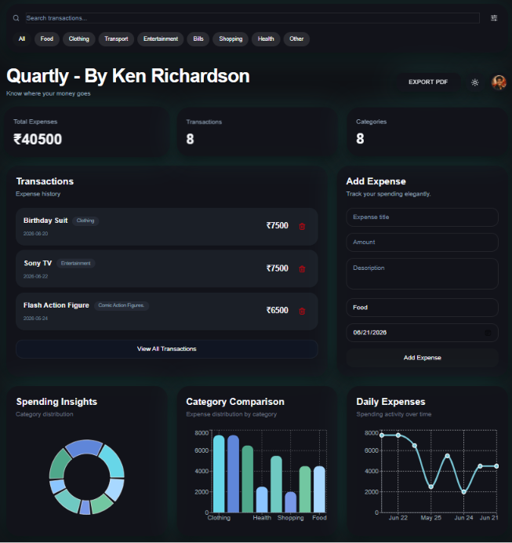

### Transactions

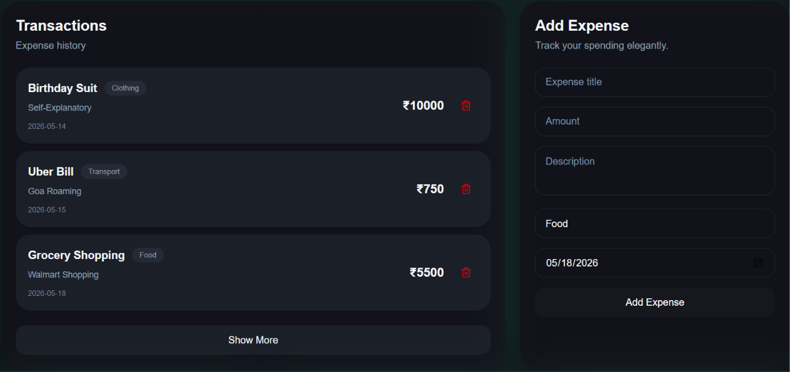

### Analytics

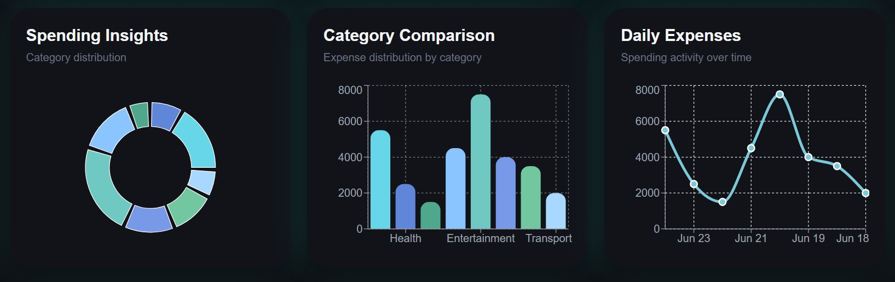

### Transaction Modal

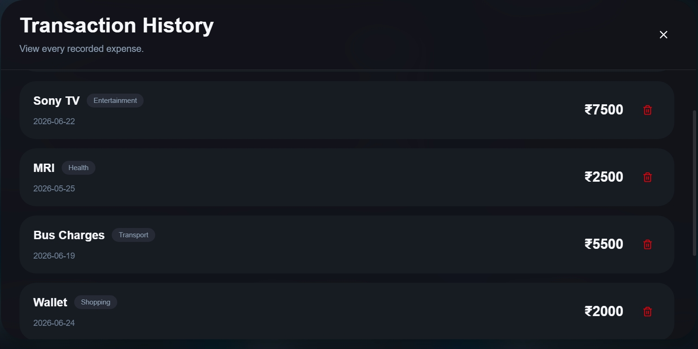

### Insights Page

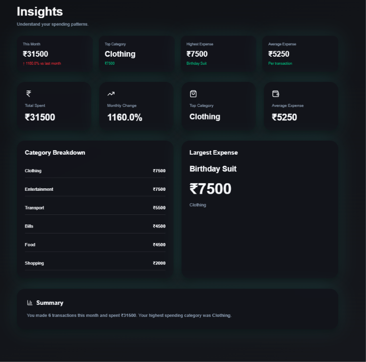

---

# 🎯 Project Goals

Quartly was created to explore:

* Modern Product Design
* Frontend Engineering
* Financial Analytics
* Cloud-Based Architecture
* Authentication Systems
* Responsive User Experiences

---

# 🔮 Planned Features

* Dedicated Charts Page
* Budget Goals System
* Category Budgets
* Spending Alerts
* Enhanced Analytics
* Settings Page
* Additional Cloud Features

---

# 👨‍💻 Creator

Kenny Richardson Kodipally

Built as a portfolio project focused on modern frontend engineering, product design, analytics, and cloud-based application architecture.

---

# 📜 License

Quartly Personal Use License

Personal, educational, portfolio, and learning use permitted.

Commercial use, resale, sublicensing, SaaS offerings, redistribution for profit, and commercial derivatives are prohibited without written permission from Kenny Richardson Kodipally.
